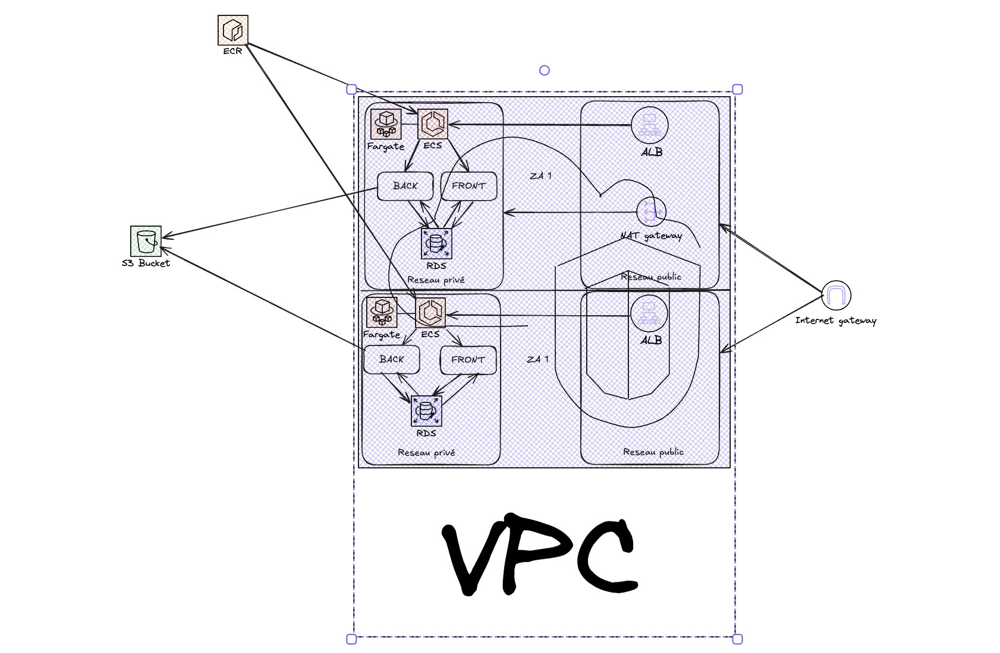

Pour déployer cette application sur AWS, l’architecture est conçue pour être simple, scalable et résiliente. Elle repose sur des services managés pour réduire les tâches d'administration tout en assurant la haute disponibilité en cas de défaillance.
L'infrastructure est construite dans un VPC qui isole le réseau de l’application. Ce VPC est divisé en deux AZ pour répartir la charge et garantir la continuité en cas de panne dans l'une des zones. Chaque AZ contient un sous-réseau public et un sous-réseau privé.
Dans les sous-réseaux publics, on trouve un Load Balancer pour distribuer le trafic de l'application, permettant de gérer efficacement les requêtes des utilisateurs et de fournir une expérience fluide même sous forte charge. Une NAT Gateway est également placée dans les sous-réseaux publics, permettant aux instances dans les sous-réseaux privés d'accéder à Internet pour des mises à jour sans être elles-mêmes exposées.
Les sous-réseaux privés accueillent des instances ECS Fargate pour héberger les conteneurs Docker du frontend et du backend. Fargate est pertinent dans notre cas car il s'agit d'un service serverless qui simplifie le déploiement et réduit les besoins en gestion des serveurs. Le backend est connecté à une base de données RDS dans les mêmes sous-réseaux privés, assurant la sécurité des données et offrant une gestion automatique des sauvegardes et de la récupération.
Les images Docker (backend et frontend) sont stockées dans l'ECR, un service géré pour héberger des images de conteneurs, permettant à ECS de récupérer facilement les images Docker. De plus, le backend peut interagir avec un bucket S3 situé en dehors du VPC, pour stocker des données volumineuses ou des fichiers statiques de manière fiable et sécurisée.
Cette infrastructure est donc managée et serverless, réduisant les efforts de maintenance et de configuration. La répartition sur deux zones de disponibilité limite l'impact d'une panne éventuelle.

Le service AWS vous avez utilisé pour uploader les images Docker et les rendre disponibles dans le projet AWS est Amazon ECR

